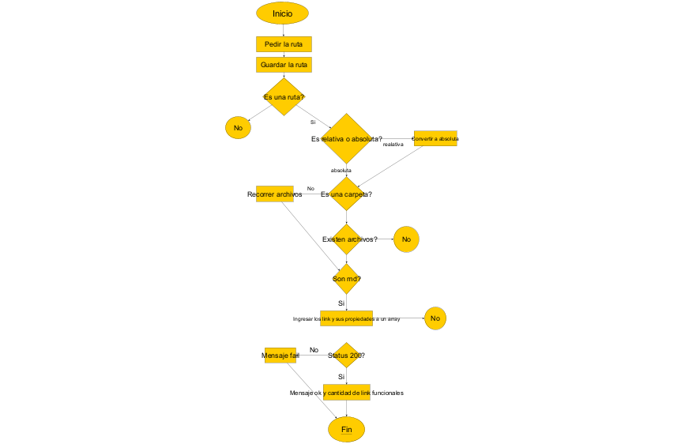

# Md-Links

## Índice

* [1. Características de la librería](#1-características-de-la-librería-📋)
* [2.  Diagrama de flujo](#2-Diagrama-de-flujo)
* [3. Modo de uso](#3Modo-de-uso-📘)
* [4. Consideraciones generales](#4-consideraciones-generales)
* [5. Criterios de aceptación mínimos del proyecto](#5-criterios-de-aceptación-mínimos-del-proyecto)
* [6. Entregables](#6-entregables)
* [7. Hacker edition](#7-hacker-edition)
* [8. Pistas, tips y lecturas complementarias](#8-pistas-tips-y-lecturas-complementarias)
* [9. Checklist](#9-checklist)
* [10. Achicando el problema](#10-achicando-el-problema)

***

## 1.  Características de la librería  📋
##md-links-Lidianys## es una librería para poder determinar links válidos e inválidos y estadística de estos, en un archivo de extensión md, a traves de las opciones ##--validate ##, ##--stats ##o ambas.

## 2. Diagrama de flujo
El diagrama de flujo de la librería es este:
 

## 3. Modo de uso 📘

## 3.1 Instalación 🔧
  Coloque el siguiente comando en la terminal
### npm i md-links-lidianys

## 3.2 Sintaxis
> **md-links <*Ruta*> [*Opciones*]**

** *Ruta* **: 
Ruta absoluta o relativa del archivo a revisar links. 

** *Opciones* **:

-  **-validate**: 

- **-stats**:

